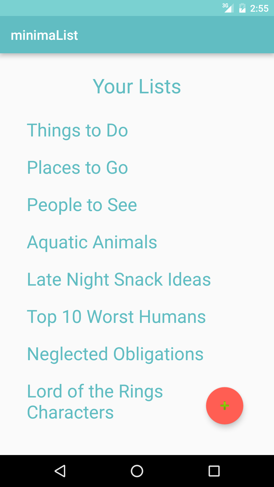
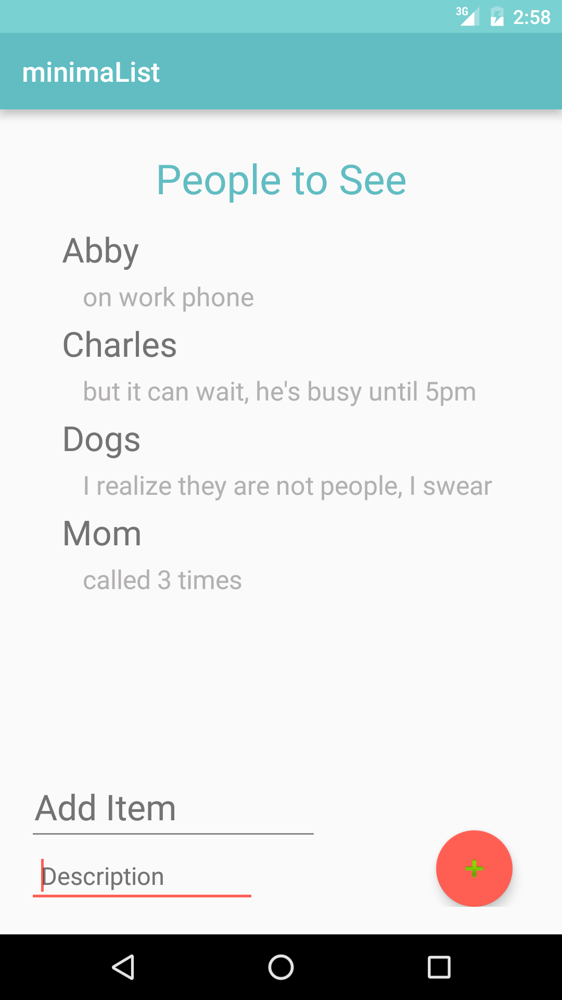

#minimaList

The first Activity of this app displays the collection of lists. 
To add a new list, tap the button on the bottom right side. This will open a dialog box that prompts you to enter a title for the new list. If you attempt to leave the edittext empty, it calls an error asking you to name your list.
When you click on a list, it takes you to the next activity where you can input items. 
Additionally, a Toast appears instructing you to hold down on the title in order to delete list.
In the second Activity, an item name and description can be input, and you tap the button to add them to the recyclerview above. When you add an item, it allows no input because sometimes a description is unnecessary. 
A short click on an item makes a Toast appear that instructs you to hold an item to delete it. 

That's it! No bugs that I am aware of.

---
  
  
